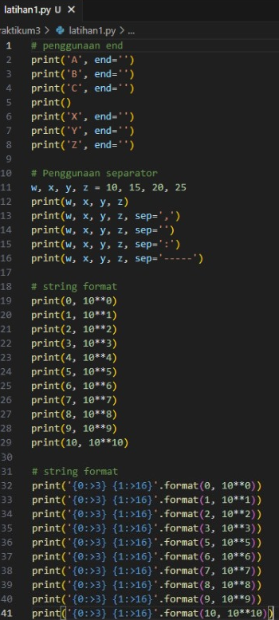
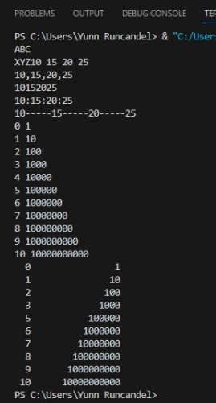
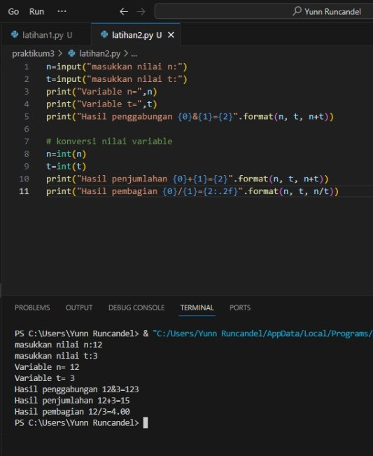
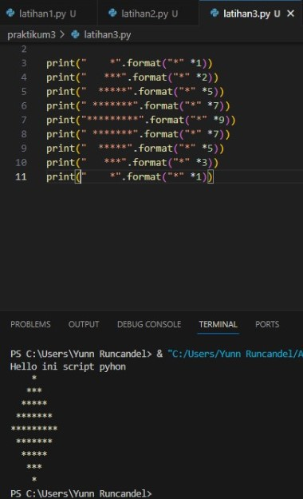
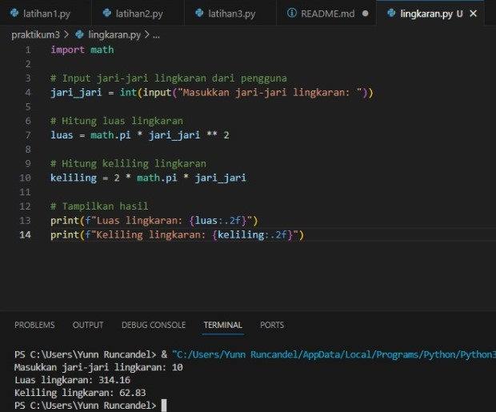
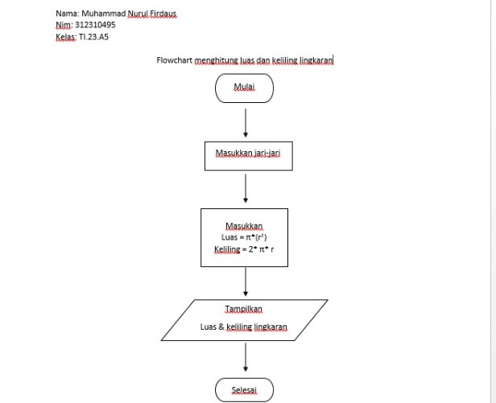

# Praktikum3
> Tugas Bahasa Pemrograman | Universitas Pelita Bangsa

## Laporan Praktikum
### Latihan 1

    # penggunaan end
    print('A', end='')
    print('B', end='')
    print('C', end='')
    print()
    print('X', end='')
    print('Y', end='')
    print('Z', end='')

    # Penggunaan separator
    w, x, y, z = 10, 15, 20, 25
    print(w, x, y, z)
    print(w, x, y, z, sep=',')
    print(w, x, y, z, sep='')
    print(w, x, y, z, sep=':')
    print(w, x, y, z, sep='-----') 

    # string format
    print(0, 10**0)
    print(1, 10**1)
    print(2, 10**2)
    print(3, 10**3)
    print(4, 10**4)
    print(5, 10**5)
    print(6, 10**6)
    print(7, 10**7)
    print(8, 10**8)
    print(9, 10**9)
    print(10, 10**10) 
 
    # string format
    print('{0:>3} {1:>16}'.format(0, 10**0))
    print('{0:>3} {1:>16}'.format(1, 10**1))
    print('{0:>3} {1:>16}'.format(2, 10**2))
    print('{0:>3} {1:>16}'.format(3, 10**3))
    print('{0:>3} {1:>16}'.format(5, 10**5))
    print('{0:>3} {1:>16}'.format(6, 10**6))
    print('{0:>3} {1:>16}'.format(7, 10**7))
    print('{0:>3} {1:>16}'.format(8, 10**8))
    print('{0:>3} {1:>16}'.format(9, 10**9))
    print('{0:>3} {1:>16}'.format(10, 10**10))

### Penggunaan end:
Penggunaan end dalam print memungkinkan Anda menentukan karakter yang akan digunakan sebagai akhir dari setiap pernyataan print. Dalam contoh pertama, karakter akhir adalah kosong (''), sehingga tidak ada karakter akhir di setiap pernyataan print. Dalam contoh kedua, karakter akhir adalah baris baru (\n), sehingga setiap pernyataan print diikuti oleh baris baru.

### Penggunaan separator:
Penggunaan separator memungkinkan Anda menentukan karakter yang akan digunakan sebagai pemisah antara setiap argumen yang dicetak dengan fungsi print. Dalam contoh ini, variabel w, x, y, dan z dicetak dengan berbagai pemisah.

### String Formatting:
Pada bagian akhir kode, format string digunakan untuk mengatur tata letak cetakan. {0:>3} berarti mengambil nilai dari indeks ke-0 dan memformatnya dalam lebar minimum 3 karakter, rata kanan (>) pada bidang lebar 16 karakter. {1:>16} mengambil nilai dari indeks ke-1 dan memformatnya dalam lebar minimum 16 karakter, rata kanan pada bidang lebar 16 karakter.

>Contoh

>Output

### Latihan2

    n=input("masukkan nilai n:")
    t=input("masukkan nilai t:")
    print("Variable n=",n)
    print("Variable t=",t)
    print("Hasil penggabungan {0}&{1}={2}".format(n, t, n+t))

    # konversi nilai variable
    n=int(n)
    t=int(t)

    print("Hasil penjumlahan {0}+{1}={2}".format(n, t, n+t))
    print("Hasil pembagian {0}/{1}={2:.2f}".format(n, t, n/t))

* Fungsi 'input()' digunakan untuk memperoleh masukan dari pengguna melalui konsol. Pada baris pertama, pengguna diminta untuk memasukkan nilai 'n', dan pada baris kedua, pengguna diminta untuk memasukkan nilai 't'. Nilai-nilai yang dimasukkan oleh pengguna kemudian disimpan dalam variabel 'n' dan 't' menggunakan operator penugasan '='. Dengan kata lain, nilai yang dimasukkan oleh pengguna ditetapkan sebagai nilai dari 'n' dan 't' (n = nilai yang dimasukkan oleh pengguna).

* Metode 'format()' digunakan untuk memformat string dengan nilai-nilai yang ingin dimasukkan. Pada baris ketiga kode, metode 'format()' digunakan untuk mencetak nilai 'n' dan 't', dan juga hasil penggabungannya menggunakan operator '+'. Dalam penggunaan ini, kurung kurawal '{}' digunakan sebagai placeholder yang akan digantikan oleh nilai sesungguhnya. Metode 'format()' kemudian menggantikan placeholder tersebut dengan nilai 'n' dan 't' yang dimasukkan oleh pengguna.

* Setelah itu, nilai 'n' dan 't' dikonversi dari string menjadi bilangan bulat menggunakan fungsi 'int()'. Ini diperlukan karena operator '+' hanya dapat digunakan dengan bilangan bulat, bukan string.

* Metode 'format()' kemudian digunakan lagi untuk mencetak hasil penjumlahan 'n' dan 't', serta hasil bagi 'n' dan 't'. Bagian ':.2f' pada string format digunakan untuk menentukan bahwa hasil bagi harus dibulatkan menjadi dua tempat desimal, sehingga menghasilkan hasil yang lebih akurat.

>Contoh

### Latihan3

print("Hello ini script pyhon")

print("    *".format("*" *1))
print("   ***".format("*" *2))
print("  *****".format("*" *5))
print(" *******".format("*" *7))
print("*********".format("*" *9))
print(" *******".format("*" *7))
print("  *****".format("*" *5))
print("   ***".format("*" *3))
print("    *".format("*" *1))

* Baris pertama dalam kode mencetak pesan sederhana dengan menggunakan fungsi print().
* Sisa kode terdiri dari sembilan baris yang menggunakan pemformatan string untuk mencetak pola belah ketupat.
* Dalam proses ini, metode format() dimanfaatkan untuk menyisipkan string tanda bintang (*) ke dalam templat string yang mengandung spasi dan karakter baris baru.
* Jumlah tanda bintang dalam setiap baris bertambah dari 1 menjadi 9, lalu berkurang kembali menjadi 1, membentuk pola belah ketupat.
* Setiap baris pola belah ketupat dicetak menggunakan fungsi print(), dan metode format() digunakan untuk menyisipkan tanda bintang yang sesuai ke dalam templat string.

>Contoh

### Lingkaran
    import math

    # Input jari-jari lingkaran dari pengguna
    jari_jari = int(input("Masukkan jari-jari lingkaran: "))

    # Hitung luas lingkaran
    luas = math.pi * jari_jari ** 2

    # Hitung keliling lingkaran
    keliling = 2 * math.pi * jari_jari

    # Tampilkan hasil
    print(f"Luas lingkaran: {luas:.2f}")
    print(f"Keliling lingkaran: {keliling:.2f}")

* Import math : memanggil modul matematika bawaan python
* line 4 : membuat variabel untuk mengambil input jari - jari bertipe integer
* line 7 : menghitung luas menggunakan math pi operasi matematika python bertipe data float
* line 10 : menghitung keliling lingkaran dan memanggil input jari-jari
* line 13 : menghasilkan output luas menggunakan f string
* {luas:.2f} : memanggil output dari variabel luas dan keliling berupa float dengan maks output 2 angka setelah koma (.)
* line 14 : menghasilkan output keliling menggunakan f string

>Contoh

### Flowchart

* Masukkan jari-jari lingkaran (r)
* Hitung Luas Lingkaran dengan rumus L = pi * r * r
* Hitung Keliling Lingkaran dengan rumus K = 2 * pi * r 
* Tampilkan Luas Lingkaran
* Tampilkan keliling lingkaran
